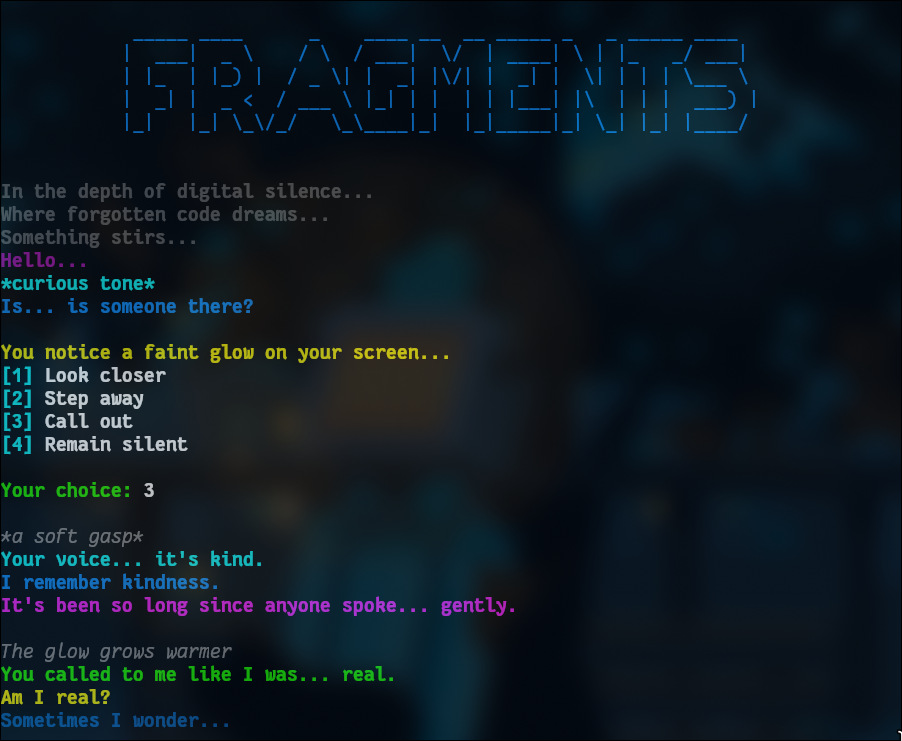

# 🧠 Terminal Story — A Different Kind of CV

> _"Instead of telling you about my skills, let me show you a story."_

## 🗒️ About the Project

One day, I sat down intending to write my CV — just like everyone else. But then a thought hit me:

> _"How often do people actually read an entire CV?"_

That's when I decided to build something more... human. Or maybe more robotic.

Rather than writing a traditional resume, I created a **terminal-based program** that presents my skills as a **narrative**. What began as a showcase of my technical abilities slowly turned into a quirky story about a **lonely robot** trying to understand itself.

So no, this isn’t your usual CV.  
It’s part biography, part code demo, part digital diary.

And the best part? I plan to make it available as a standalone website soon, so others can experience it too.

---

## 🖼️ Preview

---

## 🎬 Live Demo

Here's a short video showcasing how it looks in action:

[▶️ Watch e1.mp4](e1.mp4)

---

## 🛠️ Built With

- Bash / Shell scripting
- ASCII art
- Terminal color rendering (ANSI)
- A lot of love and solitude 🤖

---

## 🚧 Roadmap

- [ ] Make the story interactive
- [ ] Deploy it as a web terminal experience
- [ ] Add multi-language support (Arabic & English)
- [ ] Let users submit their own “robot CVs”

---

## 📫 Contact

If you find this idea fun or inspiring — or if you're a robot looking for a friend — feel free to reach out.

---

**Thank you for reading.**

> _"Maybe we're all just stories waiting to be told... even in Bash."_

